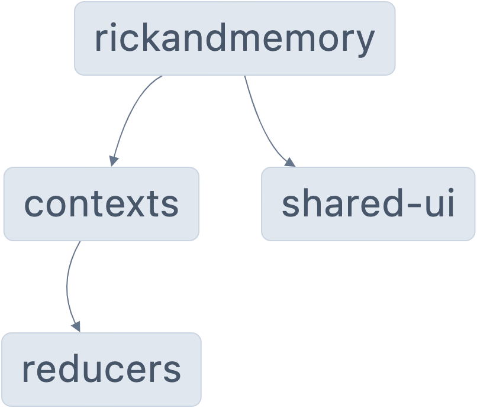

# Rickandmemory

✨ **This workspace has been generated by [Nx, a smart, fast, and extensible build system.](https://nx.dev)** ✨

Rickandmemory is a memory game featuring characters from the popular TV show Rick and Morty. The game is built using React and consumes the Rick and Morty API to fetch character data.

## Game Features

The game consists of two main views:

1. **Main View**: This view displays a list of Rick and Morty characters. At the end of the content, there is a "Play" button that redirects to the Game View.

2. **Game View**: This view presents a 3x4 grid of characters for the memory game. It also includes a counter for correct matches and a counter for turns. When the game ends, a message is displayed indicating the total number of turns taken.

## Game Instructions

- At the start of the game, the cards are shuffled and displayed for 3 seconds before being turned face down.
- During the game, when two cards are selected, they are compared to check if they match, and the turn counter is increased.
- If the cards match, they remain visible for 1 second and then disappear, and the match counter is increased.
- If the cards do not match, they remain visible for 1 second and then are turned face down again. Other cards cannot be selected while the selected cards are visible.
- When all pairs of cards have been found, a message is displayed indicating the total number of turns taken, and two buttons are displayed: "Repeat" and "Start". The "Repeat" button restarts the game, and the "Start" button redirects to the Main View.

## Development server

Run `nx serve rickandmemory` for a dev server. Navigate to http://localhost:4200/. The app will automatically reload if you change any of the source files.

## Understand this workspace

Run `nx graph` to see a diagram of the dependencies of the projects.

## Further help

Visit the [Nx Documentation](https://nx.dev) to learn more.

## Project Setup

This project was bootstrapped with Nx and uses React for the UI. The styles are written in SCSS. The project is set up to use the Rick and Morty API for fetching character data. The project also includes unit tests.

## Monorepo

The project uses a monorepo structure managed by Nx. This allows for easy management of the different modules of the project, each responsible for a specific feature of the application. The main modules are:

- `@rickandmemory/shared/ui`: This module contains shared UI components used across the application.
- `@rickandmemory/contexts`: This module provides the game logic and state management using React's Context API.
- `@rickandmemory/hooks`: This module contains custom hooks used in the application.
- `@rickandmemory/reducers`: This module contains the reducer functions for the application's state management.

## Tailwind CSS

Tailwind CSS is used to define the design system of the application. It's a utility-first CSS framework that allows for highly customizable designs.

## Storybook

Storybook is used for building the design system and for visual testing. It provides a sandbox to build UI components in isolation so you can develop hard-to-reach states and edge cases.

## CSS Modules

CSS Modules are used as a strategy to avoid class name collisions. With CSS Modules, a unique class name is generated when the CSS is transformed,

ensuring that no two classes have the same name, thus avoiding any potential conflicts.

## Deployment

The application has been deployed on GitHub Pages and can be accessed at the following URL: [https://oscm91.github.io/rickandmemory/](https://oscm91.github.io/rickandmemory/)